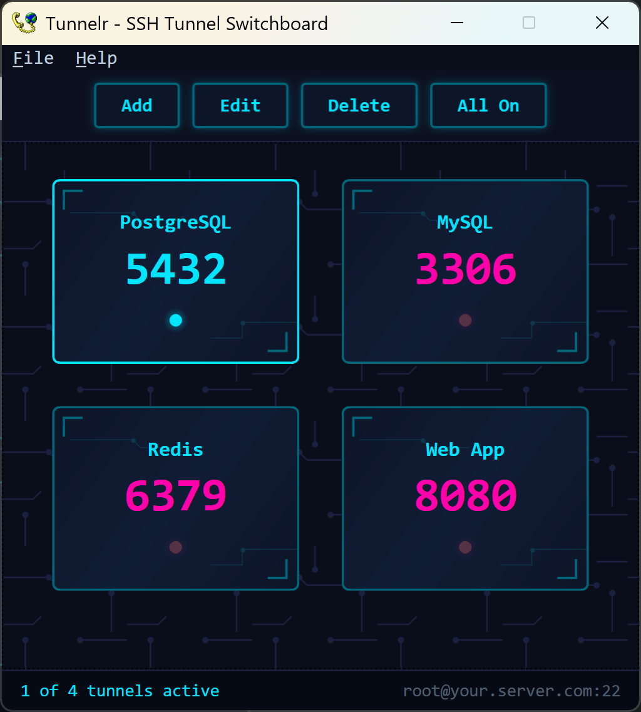

# Tunnelr - SSH Tunnel Switchboard

A cyberpunk-themed Windows desktop app for managing SSH local port forwarding tunnels. Toggle tunnels on and off with a single click, add/edit/delete tunnels with nicknames, and keep everything running from the system tray.


## What It Does

Each tunnel runs `ssh -L <port>:localhost:<port> user@server -p <ssh-port> -N` as its own process. Tunnelr gives you a visual switchboard to manage them all:

- **Card-based UI:** each tunnel gets a neon-glowing card showing port, nickname, and live status
- **One-click toggle:** click a card to connect/disconnect that tunnel
- **Bulk control:** "All On / All Off" button for quick switching
- **System tray:** minimizes to tray with per-tunnel toggle menu, keeps running in the background
- **Health monitoring:** automatically detects when SSH processes die and updates the UI
- **Config persistence:** saves tunnels and server settings to `tunnels.json`

## Screenshots



## Prerequisites

- **Windows 10/11** with .NET 7 runtime
- **OpenSSH client** installed (`ssh.exe` must be on PATH)
  - Windows 10+: Settings > Apps > Optional Features > OpenSSH Client
- **SSH key authentication** configured on your server
  - Your private key should be in `~/.ssh/` (e.g. `id_rsa`, `id_ed25519`)
  - The corresponding public key must be in `~/.ssh/authorized_keys` on the server
- **No password prompts:** Tunnelr uses key-based auth only (no interactive password input)

## Download

| File | Size | Requirements |
|------|------|--------------|
| `tunnelr.exe` | ~152 MB | None — runs anywhere, .NET runtime is bundled |
| `tunnelr_minimal.exe` | ~208 KB | [.NET 7 Desktop Runtime](https://dotnet.microsoft.com/en-us/download/dotnet/7.0) must be installed |

Both are single-file, portable executables. No installer needed — just download and run.

### Build from source

```bash
git clone https://github.com/jordankzf/tunnelr.git
cd tunnelr
dotnet build
dotnet run
```

### First run

On first launch, Tunnelr will prompt you to configure your SSH server:

1. Enter your server address (IP or hostname)
2. Enter the SSH port (default: 22)
3. Enter your username

Default tunnels are created for quick setup. Edit or delete them as needed.

## Usage

| Action | How |
|--------|-----|
| Toggle a tunnel | Click its card |
| Add a tunnel | Toolbar > **Add** |
| Edit a tunnel | Toolbar > **Edit** > select > modify |
| Delete a tunnel | Toolbar > **Delete** > select > confirm |
| Toggle all tunnels | Toolbar > **All On** / **All Off** |
| Change server | File > **Server Settings** |
| Minimize to tray | Close the window (X button) |
| Restore from tray | Double-click the tray icon |
| Toggle from tray | Right-click tray icon > click a tunnel |
| Exit completely | File > **Exit** or tray > **Exit** |

## How It Works

Each tunnel is an independent `ssh` process:

```
ssh -L 5432:localhost:5432 user@your.server.com -p 22 -N \
    -o StrictHostKeyChecking=no \
    -o ExitOnForwardFailure=yes \
    -o ServerAliveInterval=30 \
    -o ServerAliveCountMax=3
```

- `-L` local port forwarding
- `-N` no remote command (tunnel only)
- `ExitOnForwardFailure=yes` fail immediately if the port is already in use
- `ServerAliveInterval/CountMax` detect dead connections within ~90 seconds

A background health timer checks every 5 seconds for crashed processes and updates the UI.

## Project Structure

```
tunnelr/
  App.xaml / App.xaml.cs        # WPF entry point
  GlobalUsings.cs               # Explicit usings (WPF + WinForms coexistence)
  Models/
    TunnelInfo.cs               # TunnelInfo and AppConfig models
  Services/
    TunnelConfig.cs             # JSON config load/save + first-run detection
    TunnelProcess.cs            # SSH process start/stop/health management
  Controls/
    TunnelCard.xaml / .cs       # Neon-glowing tunnel card UserControl
  Views/
    MainWindow.xaml / .cs       # Main switchboard window + system tray
    AddTunnelDialog.xaml / .cs  # Add tunnel dialog
    EditTunnelDialog.xaml / .cs # Edit tunnel dialog
    DeleteTunnelDialog.xaml / .cs # Delete/picker dialog
    ServerSettingsDialog.xaml / .cs # SSH server configuration
    HowToUseDialog.xaml / .cs   # Built-in usage guide
  Themes/
    CyberTheme.xaml             # Cyberpunk color palette, glow effects, styles
```

## Config

Settings are stored in `tunnels.json` next to the executable:

```json
{
  "server": "your.server.com",
  "port": 22,
  "user": "root",
  "tunnels": [
    { "port": 5432, "nickname": "PostgreSQL" },
    { "port": 6379, "nickname": "Redis" }
  ]
}
```

## Tech Stack

- **C# / .NET 7:** Windows desktop target
- **WPF:** UI framework with custom cyberpunk theme (neon glows, circuit board pattern, animated cards)
- **WinForms NotifyIcon:** system tray support (WPF has no native tray API)
- **System.Text.Json:** config serialization

## Made with <3 by [@jordankzf](https://github.com/jordankzf)
